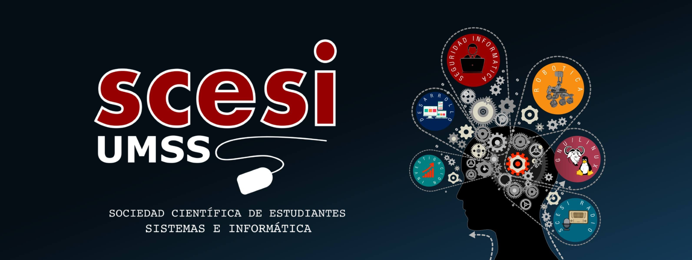
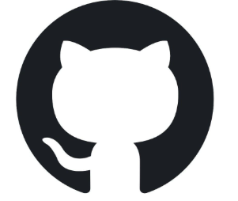

# Curso de git y GitHub🚢

### postulante:🚢

>*bladimir luna corrales*

### Pasante:

### HMIGU

>* mis apuntes de gitHub  

>* mis apuntes de git  
---
## temario👀

**Como aprender👀❓ te dejo el tip.**

> [!TIP]
>
> 1. Introducion
> 2. states - commits
> 3. Ramas - merge - conflictos
> 4. gitHub
> 5. push - pull & pull request
> 6. gitFlow
> 7. buenas practicas
> 8. Deshacer cambios
> 9. hooks - alias y trucos de git

---

## 🚀 [INICIO RÁPIDO - Apuntes del Profesor](./Inicio-Rapido/README.md)

**¿No sabes por dónde empezar?** 👇

Aquí encontrarás un **resumen de los 8 días de clases** con: Aux Isac

✅ Conceptos clave de cada día  
✅ Ejemplos prácticos  
✅ Comandos organizados por tema  
✅ Tabla de referencia con todos los comandos  
✅ Tips profesionales y buenas prácticas

[→ Ir a Inicio Rápido](./Inicio-Rapido/README.md)
