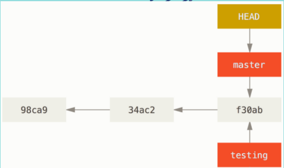
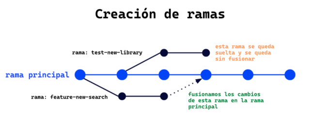
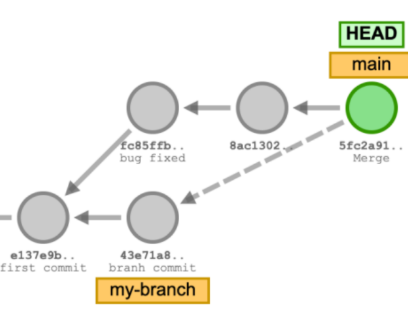
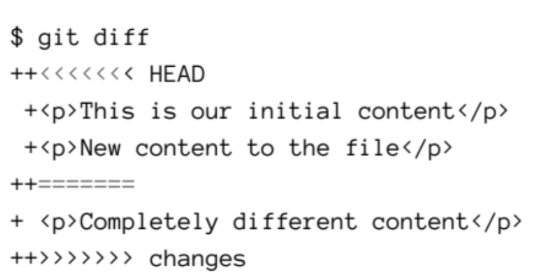

# RAMAS, MERGE Y CONFLICTOS

## Que es una rama?

son una instantanea (snapshot) de la division de codigo de distintos estados.
snapshot: copia del estado 
es un apuntador hacia una de la confirmaciones.



## Para que sirven las ramas?
 permiten realizar un desarrollo no lineal y colaborativo.

## Como Usar nuetras ramas?



### el comando git branch nos permite crear , listar, eliminar, renombrar ramas. 

1. creacion de una rama
```bash
git branch miprimeraRama
```
2. cambiamos de rama con:
```bash
git switch mi-primera-rama
Switched to branch 'mi-primera-rama'
```

3. quieres crear y dirigirte o cambiar puedes hacer:
```bash
git switch -c mi-primera-rama
```
4. eliminar una rama, no te dejara eliminar una rama aun no fucionada usa "-D"
```bash 
git branch -d mi-pimera-rama
#borramos
deleted branch mi-primera-rama (was 7c6065)
```
>[!IMPORTANT]
>antes de borrarlo asegurate de estar seguro podrias perder muchas horas de trabajo.

1. Listar ramas disponibles 
solo una puede estar activa y se ve * antes del nombre es que estas trabjando ahi 
```bash
git branch
git branch --show-current
git branch --sort=committerdate
```
6. renombrar rama 
```bash
git branch -m nuevoNombre
```
## Como usar Checkount?
### se lo cambio por el switch
vemos que git checkout cambia entre ramas y restaura el directorio del trabajo
nota: no hace bien su trabajo segun la filosofia de Unix.
```bash
git checkout
```
# Fucionar ramas
se implementa el codigo git merge <la-rama-a-la-que-queremos-fucionar>, para esto debemos estar en la rama a la que vamos a traer los cambios pereso debemos verificar bien.
```bash
git merge my-branch
```
crear un commit de la rama que estamos fucionando a la rama princiopal,absolutamente todo asta los commits.

>[!TIP]
>el commir viene por defecto de la rama que trajiste a fucionar, pero si quieres cambiarlo:
```bash
#abre el editor antes del commit
git merge --edit
# eviata que se haga el commit automaticamente
git merge --no-commit
```
## Resolver Conflictos
### saber detectar o anticipar conflictos
Git no es capas de detectar el cambio que debe guardar o subir poreso es importante que el usuario lo resuelva.

git por defecto nos va indicar con lineas que nosotros no agregamos y nosotros debemos decirdir que es lo que queremos mantener y que es lo que debemos eliminar o tambien formar un hibrido y de esa manera mantener.

>[!IMPORTANT]
>despues de resolver el conflicto se debe hacer un commit!

## Eliminar ramas que ya no se usan
a esto se refiere a las que no estan en el repositorio remoto pero siguen estando en el local sin uso entonces se las puede podar o eliminar:\
1. este bash solo muestra las ramas que dejaron de estar enlazadas al repo remoto, no lo elimina por "--dry-run"
```bash
git remote prune origin --dry-run
```
2. para eliminarlo todas las ramasque no son nesesarias sin el "--dry-run"
```bash
git remote prune origin 
```
