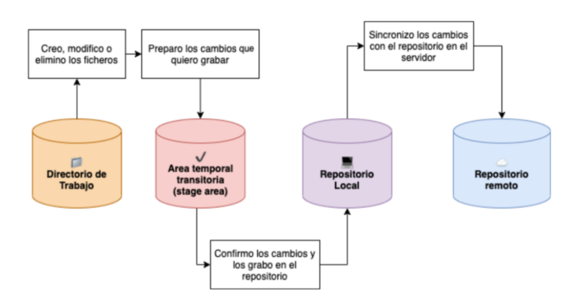
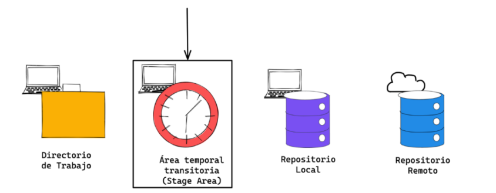
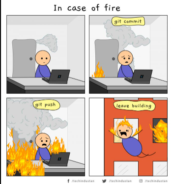

# States y Commits
## Los 3 estados de git

### Modificado (modifiel): archivo creado eliminado o contiene cambios que no han sido confirmados.
### preparado (staged): el archivo ha sido marcado como preparado y confirmado en el repositorio local.
### confirmado (commited): el archivo ha sido grabado en el repositorio local.




 Una ves confirmado los cambios se los empuja (push) al repositorio remoto para que las otras personas puedan hacer el (pull), de esta forma tener cambios sincronisados.

## Como deshacer un archivo modificado?
Acabas de modificar un fichero y ya no lo necesitas y quieres volver a la version original que tenias en tu directorio(archivo) entonces:
    Nota:Solo si has modificado un archivos o directorios que an sidocommiteado anteriormente
significa que si has cambiado algo en el archivo que ya habia sido guardado (commit).
restaurar el archivo html
```bash
 git restore index.html
```
restaura todo el directorio de trabajo
```bash
 git restore .
```
restaurar archivo terminados en *.js
```bash
 git restore '*.js'
```
Si el archivo o el directorio no exitia anteriormente entonces es mejor borrarlo manualmente.

## Como anadimos archivos al area de Stating?



en este area podemos confirmarlos para grabarlo en el reposito local.
Es el area temporal antes de subirlo al repositorio local.

1. anadirlo al staged
```bash
 git add NameArchivo.
```
## Como sacar uno o mas archivo del area de stating?
Existe un comando para volver del estado de preparad(stating)  a modificado(modifiel).
```bash
 git reset index.html
```

## Que es un Commit?
sirve para registrar cualquier cambio en el repositorio, y siempre se le da un texto breve y descriptivo.
Cada registro es como un checkPoint y muestra cada estado de todos los archivos del repositorio en que momento y quien lo hizo(firma del autor) fecha localisacion y informacion util.
es una de las piezas fundamentales para el entendimiento de git.

(agregar img)


## Como hacer un Commit?
1. Para guardar cambios que tienes en el stating(indicado), abre el editor que configuro por defecto
```bash
 git commit
 ```
 2. pero antes del commit debes anadir una referencia al commit en la rama que estas trabajando ,osea tienes que agregar un mensaje del commit.
 esta es la mejor manera:
```bash
 git commit -m "mensaje de referencia del commit"
```
3. si quiere agregar referencias lo mas parecido a un editor de codigo entonces:
```bash
 git commit -m "mensaje de referencia" -m "otro mensaje de referencia"
```
puede utilizar el parametro -m cuantas veces quiera.
### todos estos cambios se grabaron en tu repositorio local ,para revertirlo tienes que hacer nuevos commit.

4. como ver nuestros commits?
```bash
git log 
git log --oneline
git log --oneline --graph
git log | grep codigoCommit
```
5. renombrar el commit del titulo del commit pero solo del ultimo commit, pero lo cambia el idetificador
```bash
git commit --amend -m "hubo un cambio del mensaje de commit"
```
6. eliminar un commit
para cuando el commit ya este subido al repositorio remoto
```bash
git revert HEAD
```
para cuando quieres retorceder a el commit HEAD~1 y no perder los cambios de los commit anteriores.Todos los cambios aparecerán como pendientes para realizar un commit.
```bash 
git reset --soft HEAD~1
```
7. para inorar un archivo y no hacerle commit:
Debes crear un archivo ".gitignore" y agregar el nombre del archivo o carpeta es para no trakearlo(monitorearlo o preparlo)
nota: el archivo trakeado nose puede ignorar 

## Que es un HEAD?
Es una ubicacion de referencia del punto actual.
solo puedes estar en un lugar y ese lugar es HEAD.
hace referencia al repositorio en el que estas trabajando y el actual historial de cambios del repositorio.
1. como ver donde estas?
```bash
git switch -
```


