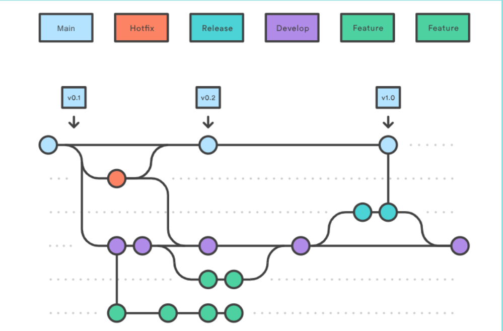
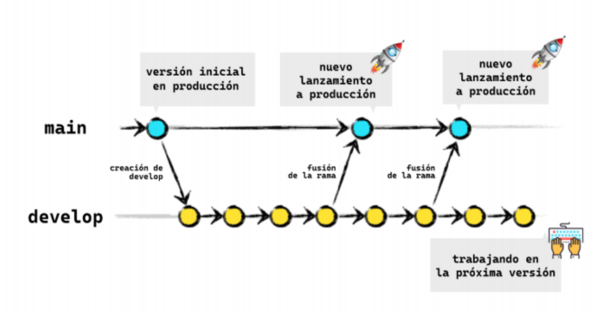
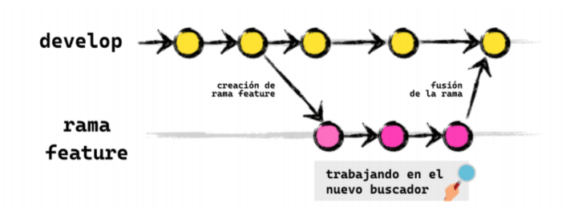
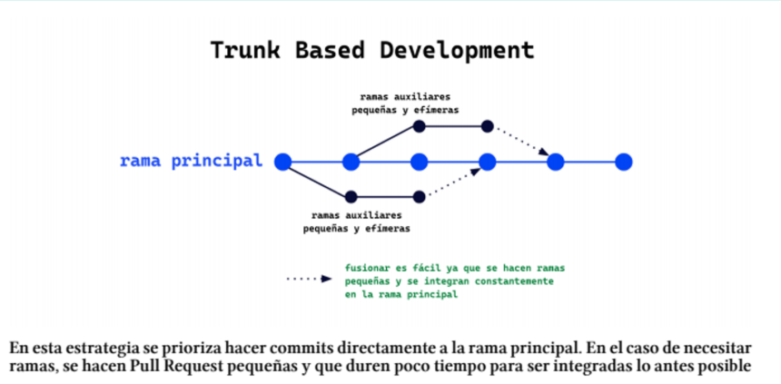
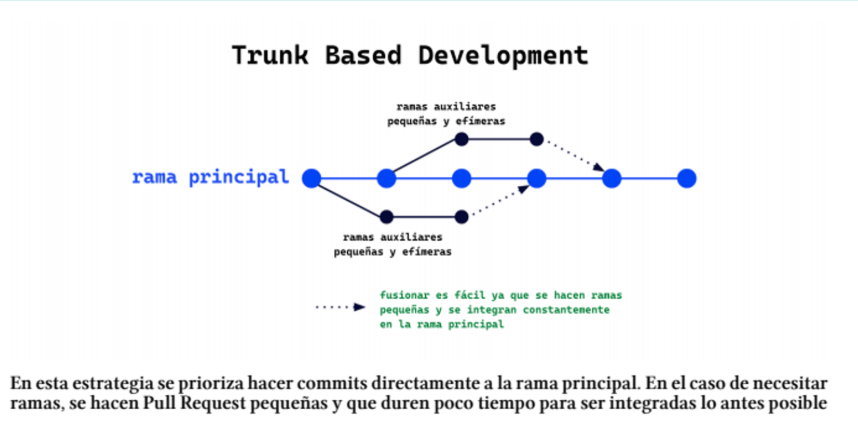

# Git Flow
para poder trabajar de manera colaborativa este es el flujo de trabaja que se usa.
## ramas que usa gitFlow
    
git para mejor administracion usa estas ramas:
### Ramas principales
1. main(master): contiene todo el codigo en producion
2. develop: codigo en pre-producion que todavia debe ser provado y confirmado(validado).
 
### Ramas de apoyo
1. feature: caracteristicas nuevas del proyecto
2. release: cambios de ultimo momento
3. hotflix: parches o arreglar bug pequenos.
>[!NOTE]
>se recomienda crear la rama con el parametro --no-ff para crear un commir antes de fucionar la rama
 

# Estrategia creada por github
creada para equipos o proyectos que hacen despliegues de manera regular o continua, se usa el pull requests
 
debemos seguir una serie de postulados para garantizar un codigo listo para la producion:
1. main: esta rama debe mantenerse protegida, la rama donde se integra los cambios.
2. feature: nace de la rama de main, estas ramas deben tener un corto lapso de vida.
```bash
- realisamos commits
- heccmos pull request
- el grupo disute las recomendaciones
- se hacen pruebas de CI (integracion Continua)/entorno de producion
```
# Trunk Based Development
llamada trunk (tronco) que normalmente corresponderá con
main, no necesita de una rama auxiliar,y si se crean tienen teimpos de vida muy cortos(dias)
 
>[!NOTE]
> PARA LOS MAS EXPERIMENTADOS
### Consideraciones a tener en cuenta para poder usarlo
>[!WARNING]
>  1. necesita un siistema de integracion continua (CI) que permita verficar que el codigo funciona
>  2. usando técnicas como la programación a pares (pair programming) o la programación en grupo (mob programming), que permiten
>  que los miembros de un equipo trabajen en conjunto con otros miembros (del mismo u otro equipo) para resolver un problema.
>  3. se deben hacer commit constantemente
>  4. existen redes de seguridad automatisadas que deshacen si no compila
>  5. la rama trunk siempre se puede desplegar
# ship / show / ask
Es importante que para hacer este flujo exista un buen sistema CI/CD, un equipo confiable con buenas practicas que haya superado el ego individuaL

### Estrategias de Fusión

| Estrategia | Descripción | Ideal para |
|------------|-------------|------------|
| 🚢 **Ship** | Los cambios se fusionan directamente a la rama principal (`main`). No hay revisión. | Personas muy seguras de lo que están haciendo. |
| 👀 **Show** | Fusiona el código a la rama principal pero abre una Pull Request para revisión opcional. | Personas que quieren una segunda opinión. |
| ❓ **Ask** | Abre una Pull Request que debe ser revisada antes de fusionarse. | Personas inexpertas o que desean recibir consejos antes de hacer merge. |
