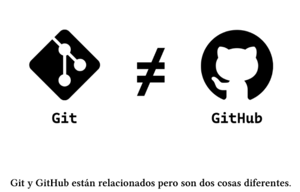

# Git y GitHub son lo mismo ,como se relacionan?
1. git : es un sistema de control de versiones, local.
2. github : servicio de alojamiento en la nube de codigo fuente basado en git, remoto.
#### se complementan de forma local y remota.
    

## Clonar un repositorio remoto
basicamente es descargar o tener en tu compu el repositorio clonado.
puedes usar https o shh del repositorio:

```bash
git clone https://github.com/DiegoFigueroaS/SCESI-GitAndGithub-ConflictoTeam.git
```

## Como enlazar un repositorio local a un repositorio remoto?
usamos el bash con dos parametros asi:

```bash
git remote add <alias> <direccion>
```

origin que viene por defecto como alias de github :

```bash
git remote add origin https://github.com/DiegoFigueroaS/SCESI-GitAndGithub-ConflictoTeam.git
```

>[!NOTE]
>un repositorio local puede tener enlazado tantos repositorios remotos como queramos.
## Comandos para sincronizar un repositorio remoto
| Comando Git          | Descripción                          |
|----------------------|--------------------------------------|
| `git remote -v`      | ver todos los repositorios remotas enlazadas y urls.  |
| `git fetch` | Descarga los cambios del repositorio remoto sin fusionarlos |
| `git push origin main` | Sube cambios al repositorio remoto |
| `git remote set-url origin https://github.com/usuario/nuevo-nombre-repo.git
` | eliminar el enlace con el repositorio remoto |
# Push 
## escribiendo en el repositorio remoto
git push es el comando que te permite enviar los cambios del repositorio local al repositorio remoto:

```bash
git push <alias-del-remoto> <rama-deseada>
```

de esta manera nuestros cambios del repositorio local se veran en el repositorio remoto.

## No me deja hacer push! me lo rechaza
esto sucede normalmente por que mi repositorio local no tiene los cambios de mi repositorio local.
quiere decir que hay cambios en el remoto que no estan en el repo local.


>[!NOTE]
>se podria forzar con -f pero no es lo mas practico por los conflictos,mejor no lo hagas si no sabes cual es el problema.

## Creacion de una rama remota
podemos crear nuestros cambios o commits y enviarlos a el remoto.
1. puedes crear una rama remota con:
```bash
git switch -c website
```

2. empujar cambios a la rama remota
```bash
git push origin website
```

>[!IMPORTANT]
> ```bash
>git bash origin rama-no-existe
>```
>ten encuenta que si intentas enviar cambios a una no existente tendras errores.
# pull 
trae el repositorio remoto y lo fuciona con el repositorio local.
```bash
git pull <alias-del-remoto> <rama-deseada>
#ejemplo
git pull origin main
```
esto es para traer los cambios del remoto a nuestro local y fusionarlos.

>[!NOTE]
>muchas veces genera conflictos debes tener cuidado
