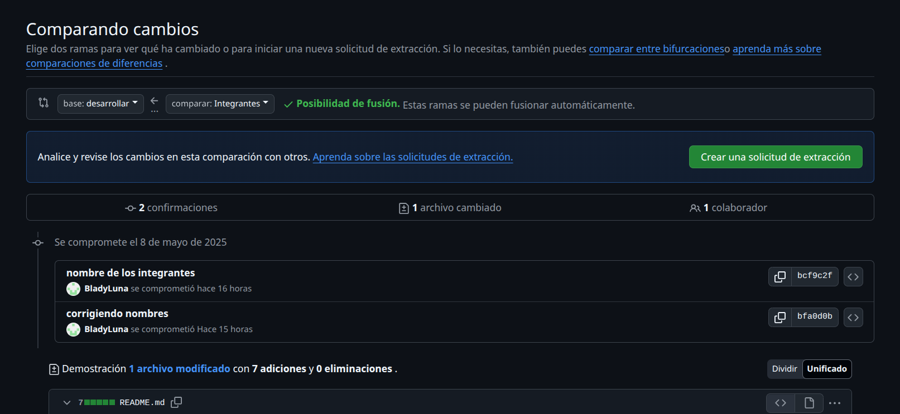
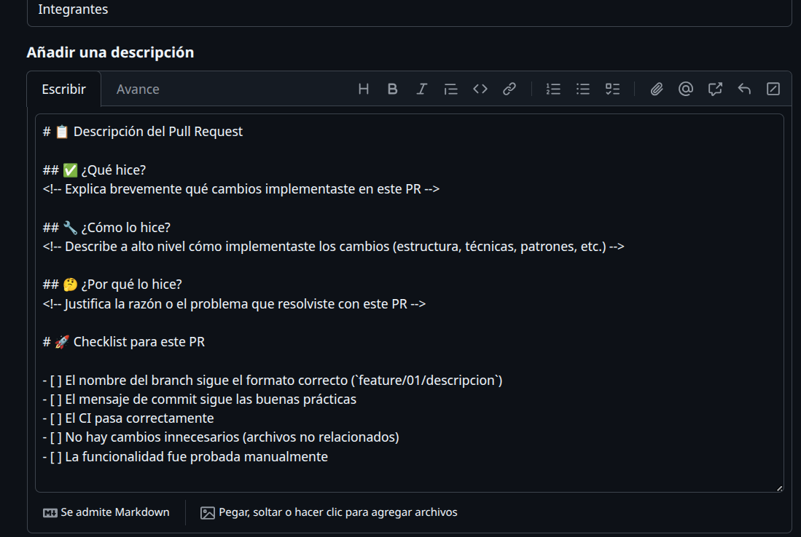

# diferencias de git push y pull

## git push
| Comando Git          | Descripción                          |
|----------------------|--------------------------------------|
| `git push`      | empujar cambios del local al remoto  |
| `git push --all` | envia todos los cambios de todas las ramas |
| `git push -f` | envia a al fuerza al repositorio remoto|
| `git push -u origin <rama>`| especifica relacion de la rama remota principal |
| `git push -d origin <rama>`|  elimina la rama de remoto |

## git pull

| Comando Git          | Descripción                          |
|----------------------|--------------------------------------|
| `git fetch origin`  |trae todos los cambios sin fucionarlos |
| `git pull`      |trae todos los cambios mergeandolo|
| `git pull --set-upstream origin <rama>`| Vincula tu rama local con la rama remota y hace un pull (trae y fusiona cambios)|
| `git pull --all` | trae todos los cambios de remoto al local fucionadolos|
| `git pull origin <rama1> <rama2> <ramaN>`| trae todos los repositorios remotos especificados|
# Que es pull Request?
un pulll request de forma abreviada PR ,es una peticion de cambios que se envia a un repositorio con el que estes trabajando en equipo.
>[!NOTE]
>como se hace un Pr?
>debes ir en github a apartado de pullrequest ahi te saldra el push que hiciste
>para ello debes subir tu rama y fucionarlo con la rama principal remota

 
### Hacer una buena PR
1. enfoca tu codigo en una sola cosa, eso quiere decir que la rama que creaste y quieres fucionar solo debe ser enfocado en un solo proposito, asi es mucho mas facil de revisar.
2. explica tu pull request , una imagen vale mas que mill palabras, pudes hacer un video o gif mostrando la funcionalidad.
### como revisar un PR
1. proporciona un feedback positivo
2. concrecion y claridad
3. entender el contexto
ejemplo:
descriocion-pullrequest
 